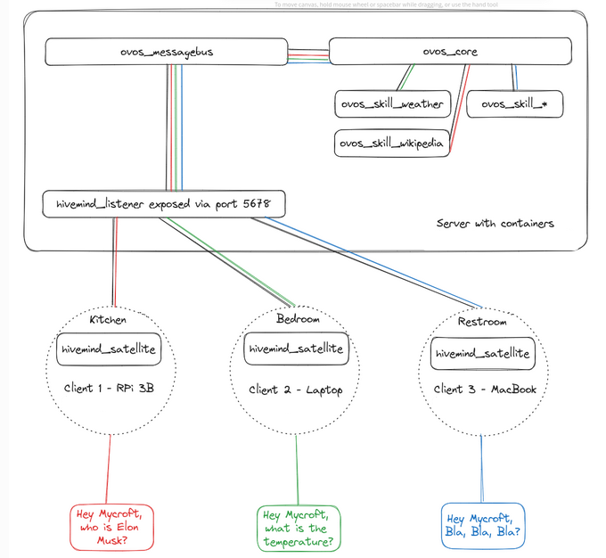

# Remote Agents with OpenVoiceOS

While OpenVoiceOS is designed primarily for **local-first usage**, more advanced deployments—like hosting agents in the cloud, connecting multiple voice satellites, or enabling multi-user access through a web frontend—are made possible via the **HiveMind** companion project.

---

## HiveMind Server

**HiveMind** is a distributed voice assistant framework that allows you to expose **AI Agents** (either full ovos-core installs or just individual personas) over a secure protocol.

> 💡 Unlike the lightweight `persona-server`, HiveMind is designed for trusted, networked setups.

**Key Features**:

- **Secure Access**: Communicates over the **HiveMind protocol**, which supports authentication, encryption and granular permissions — safe for exposing OVOS to remote clients or satellites.
- **Agent Plugins**: Agent plugins integrate the **HiveMind protocol** with various frameworks, including OpenVoiceOS. Keep your existing infrastructure even when you totally replaces the brains!
- **Multi-User Ready**: Great for use in **cloud hosting**, **web portals**, or **enterprise environments** where access control is critical.
- **Composable**: Let **local personas delegate** questions to a smarter **remote OVOS instance**.



**Typical Use-cases**:

- 🏡 Running OpenVoiceOS on a powerful server or in the cloud.
- 🛰️ Connecting lightweight devices (satellites).
- 📱 Remote access to OpenVoiceOS.
- 🧑‍🤝‍🧑 Serving multiple users or applications concurrently.

Check out the [HiveMind documentation](https://jarbashivemind.github.io/HiveMind-community-docs/) for more info

---

## HiveMind Personas

The `hivemind-persona-agent-plugin` project allows you to **expose a single persona**—not the full OVOS stack—through hivemind

This enables you to deploy AI agents for external use without needing a full OVOS assistant.

### Why Use It?
- Minimal attack surface (persona only, no full assistant features).
- Can be queried remotely using the HiveMind protocol.

> 💡 This is **not** the same as `persona-server`. `hivemind-persona-agent-plugin` uses a **secure protocol** (HiveMind), while `ovos-persona-server` uses insecure HTTP.

### Server Configuration

in your hivemind config file `~/.config/hivemind-core/server.json`

```json
{
  "agent_protocol": {
    "module": "hivemind-persona-agent-plugin",
    "hivemind-persona-agent-plugin": {
      "persona": {
	  "name": "Llama",
	  "solvers": [
		"ovos-solver-openai-plugin"
	  ],
	  "ovos-solver-openai-plugin": {
		"api_url": "https://llama.smartgic.io/v1",
		"key": "sk-xxxx",
		"persona": "helpful, creative, clever, and very friendly."
	  }
	}
    }
  }
}
```
---

## HiveMind as a Solver Plugin

Want your local assistant to ask a remote one when it's stuck? You can!

The hivemind-bus-client can function as a solver plugin, allowing you to:

- 🦾 Delegate processing to a more powerful/secure server for specific tasks.
- 🌍 Handle outages: Handle intermitent local agent failures from other solver plugins in your persona definition
- 🤝 Use remote hivemind agents in a collaborative AI / MoS (mixture-of-solvers) setup.

> 🤖 *“When in doubt, ask a smarter OVOS.”*


For usage with persona, use `"ovos-solver-hivemind-plugin"` for the solver id

```json
{
  "name": "HiveMind Agent",
  "solvers": [
    "ovos-solver-hivemind-plugin"
  ],
  "ovos-solver-hivemind-plugin": {"autoconnect": true}
}
```

You can also use it in your own python projects

```python
from ovos_hivemind_solver import HiveMindSolver

bot = HiveMindSolver()
bot.connect()  # connection info from identity file
print(bot.spoken_answer("what is the speed of light?"))
```


---

## Chaining Components for Flexible Deployments

HiveMind and persona-server can be combined to bridge secure and insecure environments, depending on your needs:

- expose existing OpenAI/Ollama servers to hivemind satellites **securely**
    - connect hivemind satellites directly to existing LLM apps (eg. ollama)
- expose a remote `hivemind-core` to local **insecure** ollama/openai endpoints
    - eg. to integrate hivemind into HomeAssistant
-  expose a localhost `ovos-core`/`persona.json` to local **insecure** ollama/openai endpoints
    - half-way compromise, does not expose the full messagebus and does not require hivemind
    - easier to setup and configure


| Use Case                          | Tool                   | Secure? | API Type              | Notes                                                | 
|----------------------------------|------------------------|---------|------------------------|------------------------------------------------------|
| Local interface + Persona | `ovos-persona-server` + `persona.json`    | ❌      | OpenAI-compatible      | Great for quick setups, not public exposure`,HTTP, no auth |
| Local interface + OpenVoiceOS | `ovos-persona-server` + `ovos-solver-bus-plugin`      | ❌      | OpenAI-compatible    | OpenVoiceOS bus must be exposed to `ovos-persona-server`,HTTP, no auth |
| Local interface + HiveMind Agent | `ovos-persona-server` + `ovos-solver-hivemind-plugin`      | ❌      | OpenAI-compatible      | Same as above, but for any remote hivemind agent,HTTP, no auth |
| Secure remote OpenVoiceOS agent  | `hivemind-core` + `hivemind-ovos-agent-plugin` + `ovos-core`    | ✅      | HiveMind protocol      | Auth, encryption, granular permissions, HTTP or Websockets                   |
| Secure remote Persona agent      | `hivemind-core` + `hivemind-persona-agent-plugin` + `persona.json`    | ✅      | HiveMind protocol      | Auth, encryption, granular permissions, HTTP or Websockets                       |


The first 3 examples allow us to integrate our Agents with HomeAssistant via the Ollama Integration

The last 2 examples allow us to integrate with HiveMind ecosystem and all the existing satellite implementations

---

## ⚠️ Related (Insecure) Alternatives

While useful for experimentation, some other persona access methods are **not secure** for remote use:

🦙 `ovos-persona-server`:

- ✅ Compatible with **OpenAI/Ollama APIs**.
- ❌ **HTTP only**, not encrypted or authenticated.
- ✅ Useful to expose personas to **HomeAssistant**, **OpenWebUI**, and similar local network tools.

🏠 HomeAssistant + `ovos-persona-server`:

- 🗣️ Can route HomeAssistant **wyoming satellites** to an OVOS persona.
- ❌ Uses **Wyoming protocol**, which lacks hivemind's security features.

