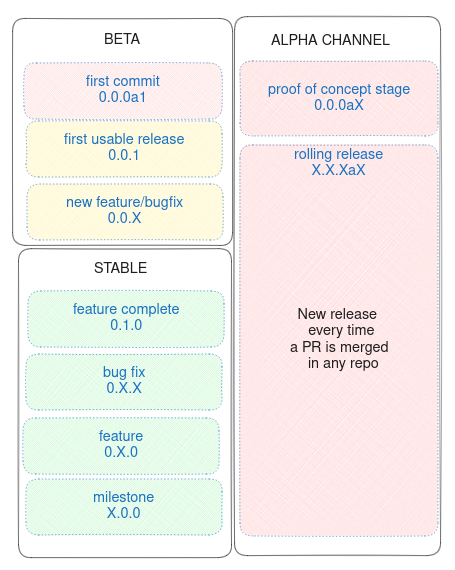
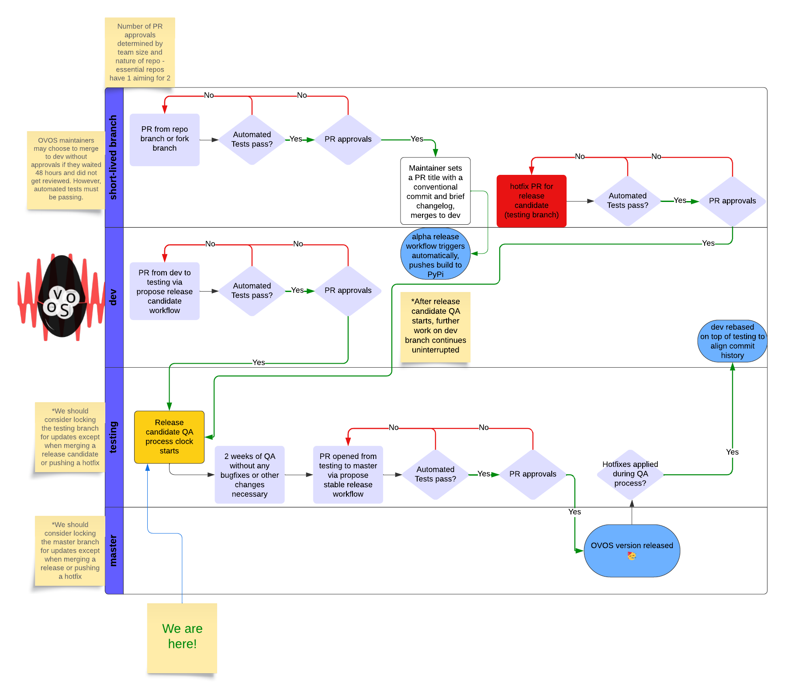

# Versioning

OVOS consists of hundreds of packages with their own release cycle, during `ovos-core` version **0.0.7** or earlier 
OVOS was a single repository forked from `mycroft-core`, since version **0.0.8** services have been split into their own repos

In this documentation we always refer to the `ovos-core` version that introduced a feature

> **NOTE** `ovos-core` version **0.0.8** is in `alpha`! there is no `stable` release yet

Packages have automated alpha releases on every Pull Request, you can install these from pypi with `pip install XXX --pre`

## Automations

Please see [github shared actions](https://github.com/OpenVoiceOS/.github)

## Release Process

